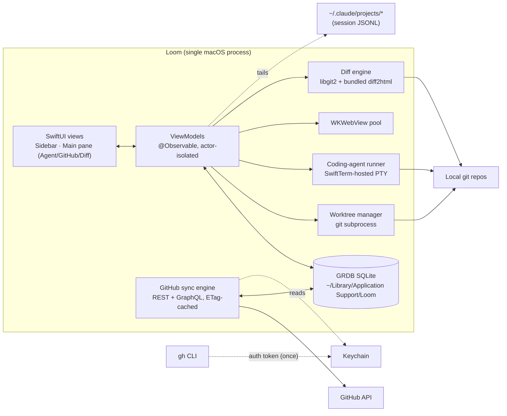

# Loom — Build Spec for Claude Code

> Working name. Rename freely; substitute throughout if you do.

---

## 0. Read this first (non-negotiable)

You are building a native macOS application from scratch over many sessions. This document is your single source of truth. You will work in **phases**. After every phase you **STOP** and wait for the human to review before starting the next.

### 0.1 Hard rules (anti-shortcut)

1. **No stubs in shipped code.** "Implement X" means X works end-to-end against real inputs. No `fatalError("not implemented")`, no `// TODO: real version later`, no returning `[]` to make the type check.
2. **Compile gate.** After every commit on a phase branch, `xcodebuild` and `make test` must both succeed. Don't move on with a red build.
3. **Tests are not optional.** Every phase adds unit tests for its core logic. Integration tests where the phase touches the filesystem, network, or another process. UI tests for sidebar interactions (Phase 4+).
4. **No mock data in app code.** Test fixtures live in `Tests/`. The shipping binary must work against real GitHub, real git, real PTYs.
5. **No skipping acceptance criteria.** Every criterion in the phase must have an entry in `coverage-ledger.md` with `[DONE]` + evidence (test name, screenshot path, log snippet) or `[BLOCKED]` + explicit reason + proposed resolution. There is no third state.
6. **No bulk implementations across phases.** If Phase N isn't accepted by the human, do not write a line of Phase N+1 code.
7. **No silent rescoping.** If a phase looks too hard, raise it at the checkpoint with the trade-offs spelled out. Do not quietly drop functionality and call it done.
8. **No commenting out tests** to make builds pass. If a test is wrong, fix the test in a commit that explains why; if the code is wrong, fix the code.
9. **No log spam.** No `print` debugging left in shipped code. Use `os.Logger` with subsystems.
10. **Secrets discipline.** The `gh` token is read once via `gh auth token`, cached in Keychain, never written to disk in plaintext, never logged.

### 0.2 Checkpoint protocol

At the end of every phase, in this exact order:

1. Run the full test suite. All green.
2. Update `coverage-ledger.md` — every acceptance criterion for the phase has its status + evidence.
3. Write `phase-N-report.md` containing: what was built, deviations from the spec (if any), test results summary, screenshots or asciinema where useful, open questions for the human.
4. Commit everything on a branch named `phase-N/<short-description>`.
5. Update `.loom-build-state.json`: bump `current_phase`, append to `completed_phases`, record git SHA.
6. **STOP.** Post a message summarising the report and explicitly asking: "Phase N complete. Review and approve to proceed to Phase N+1?"
7. Do not start Phase N+1 until the human replies with explicit approval.

If the human asks for changes during review, do them on the same phase branch and update the report. The checkpoint resets only when they say "approved" / "go" / equivalent.

### 0.3 State files you must maintain (in repo root)

- **`.loom-build-state.json`** — machine-readable progress. Schema:
  ```json
  {
    "current_phase": 0,
    "completed_phases": [],
    "started_at": "ISO-8601",
    "last_updated": "ISO-8601",
    "last_git_sha": "string",
    "blockers": []
  }
  ```
- **`coverage-ledger.md`** — human-readable. One section per phase. One row per acceptance criterion: `criterion | status | evidence`. Append-only across phases.
- **`phase-N-report.md`** — one per phase. See checkpoint step 3.
- **`decisions.md`** — running log of design decisions made during build that weren't in the spec, with rationale. Example: "Used Safari cookie store because Chrome's encrypts at rest and is unreadable without the user's login password — 2026-05-30."

### 0.4 Bootstrap (your first action)

Before writing any code:

1. Confirm you can read this entire file. Echo back the section headings.
2. Initialise `.loom-build-state.json` with `current_phase: 0`.
3. Read sections 0.1 and 0.2 back to the human verbatim. This is not a courtesy; it confirms you have ingested the rules.
4. Propose your Phase 0 plan: deps you'll add, folder structure, what the smoke-test app will do.
5. **STOP.** Wait for explicit go-ahead before scaffolding.

---

## 1. North star

Replace the current `Chrome + Warp side-by-side` workflow with a single, very fast, native macOS app. The user is a heavy Claude Code + GitHub developer working across many bsv-blockchain repos. They want to see all open assigned tasks in a sidebar, click one, and immediately have: an embedded Claude Code terminal in a fresh git worktree, the GitHub issue/PR page next to it, and (bonus) a GitHub-style diff of the branch.

Performance is the headline feature. Cold start under 800ms. Tab switching under 50ms. Memory must stay sane with 20+ open tabs.

---

## 2. Locked technical decisions

| Concern | Choice | Notes |
|---|---|---|
| Language | Swift 5.10+ | |
| UI | SwiftUI with AppKit interop where needed | NSWindow root, NSSplitView for resizable sidebar |
| Min macOS | 14 (Sonoma) | `@Observable`, latest SwiftUI |
| Coding-agent surface | SwiftTerm | https://github.com/migueldeicaza/SwiftTerm — real PTY, Metal-accelerated. Used as the rendering surface for whatever coding-agent process the user has configured (Claude, Codex, Grok, …). Not exposed as a generic shell. |
| GitHub view | WKWebView | Persistent `WKWebsiteDataStore` so login carries across restarts |
| Local storage | GRDB.swift (SQLite) | `~/Library/Application Support/Loom/loom.sqlite` |
| Git operations | `git` subprocess for worktrees + status; SwiftGit2/libgit2 for diff computation | libgit2's worktree support is incomplete; subprocess is more reliable |
| Diff rendering (bonus) | Local diff2html in a bundled WKWebView, fed from libgit2-computed patch | "Native data, web rendering" — fastest path to GitHub-fidelity quality |
| Auth | `gh` CLI as source of truth. `gh auth token` at launch. Token cached in Keychain via `KeychainAccess`. | |
| Secrets | Keychain only. Never disk. Never logs. | |
| Concurrency | Swift Concurrency (`async`/`await`, actors). No GCD unless interop forces it. | |
| Logging | `os.Logger` with per-subsystem categories: `sync`, `pty`, `git`, `ui`, `db`. | |
| Lint/format | SwiftFormat + SwiftLint, pre-commit hook | |
| Build | Xcode project committed. `Makefile` wrapping `xcodebuild` for CI. | |
| CI | GitHub Actions on macOS-latest: build + test on every PR | |
| Packaging | Signed + notarised `.dmg` via `create-dmg` in Phase 8 | |

### 2.1 Conventions

- **Worktree path:** `<parent-of-main-clone>/.worktrees/<branch-slug>` where `<branch-slug>` is the branch name with `/` replaced by `-` and any other non-`[a-zA-Z0-9._-]` char dropped.
- **Coding agents.** A tab does not run a generic shell. It runs a *coding agent* — one of a set of profiles the user has pre-configured (Claude, Codex, Grok, …). Each profile has a name, an executable command, and a list of default arguments. When an issue becomes a PR (or when starting any new tab), the user picks **which** configured agent to spawn. The first launched profile, "Claude", defaults to command `claude` with args `--dangerously-skip-permissions`; the user can edit/add/remove profiles freely.
- **Coding-agent launch:** spawn `<profile.command> <profile.args>` directly inside a PTY at the worktree path. No interactive shell wrapper. This is deliberate: a per-agent profile, not "the user's $SHELL".
- **Polling intervals** (defaults, in user preferences):
  - GitHub task list sync: 60s
  - Per-task GitHub status (CI, mergeable, comments): 90s for focused, 5min for unfocused
  - Git state for focused tab: 5s; unfocused: 30s
- **Task identity:** `(repo_full_name, type, number)` is the unique key, e.g. `("bsv-blockchain/teranode", "pr", 655)`.

---

## 3. Architecture

### 3.1 Diagram



### 3.2 Data model (GRDB tables)

```
repo
  id PK, owner, name, default_branch, local_main_path, added_at

task
  id PK, repo_id FK, type ENUM(issue,pr), number,
  title, body, state ENUM(open,closed,merged), author_login,
  github_url, api_url, created_at, updated_at, last_synced_at,
  etag

task_assignee
  task_id FK, login (composite PK)

coding_agent   -- a user-configured agent profile (Claude, Codex, Grok, …)
  id PK, name UNIQUE, command, args_json, is_default BOOL, position INT,
  created_at, updated_at

tab
  id PK, task_id FK NULL, coding_agent_id FK NULL, position INT,
  branch_name, worktree_path,
  last_main_view ENUM(agent,github,diff),
  created_at, last_active_at

github_status   -- one row per task, refreshed periodically
  task_id PK, ci_state, ci_url,
  mergeable BOOL NULL, mergeable_state TEXT,
  review_state, unread_comments_count, last_seen_comment_id,
  fetched_at

session_state   -- one row per tab, what we restore on launch
  tab_id PK, cwd, agent_command, agent_args_json,
  last_known_exit_code, pty_started_at, pty_ended_at

setting
  key PK, value
```

### 3.3 Directory layout

```
Loom/
  App/                 # @main entry, AppDelegate, scene config
  Core/
    Models/            # task, tab, repo (Codable + GRDB Record)
    GitHub/            # REST + GraphQL clients, sync engine
    Git/               # worktree manager, status reader
    Terminal/          # SwiftTerm wrapper, PTY supervisor
    Diff/              # libgit2 patch generation
    Storage/           # GRDB stack, migrations
    Auth/              # gh CLI bridge + Keychain
  Features/
    Sidebar/
    MainPane/
    Preferences/
    Onboarding/
  UI/                  # design tokens, shared components
  Resources/
    diff2html/         # bundled JS/CSS for diff view
    Assets.xcassets/
Tests/
  Unit/
  Integration/         # hits real git, mock GitHub
  UI/
.github/workflows/
Makefile
README.md
loom-spec.md           # this file lives here too
.loom-build-state.json
coverage-ledger.md
decisions.md
phase-0-report.md       # phase-N-report.md files accumulate
```

---

## 4. Phase plan

Each phase below is canonical. Don't change the order. Don't merge phases.

---

### Phase 0 — Foundation

**Goal:** an empty, signed, testable app that compiles and launches. No business logic.

**Deliverables:**
- Xcode project committed (`Loom.xcodeproj`), single app target, signing configured for local dev.
- SwiftPM deps added: SwiftTerm, GRDB.swift, SwiftGit2, KeychainAccess.
- Folder structure per §3.3 (empty modules, but present).
- `Makefile` with `build`, `test`, `lint`, `format` targets wrapping `xcodebuild` / `swiftformat` / `swiftlint`.
- SwiftFormat + SwiftLint configs.
- GitHub Actions workflow that runs `make build && make test` on every push.
- One smoke test: launches the app process headlessly and verifies main window is created.
- `os.Logger` subsystems registered.
- `Loom.entitlements` with file access, network access. No sandbox initially (document why in `decisions.md`).
- `.loom-build-state.json`, `coverage-ledger.md`, `decisions.md` initialised.

**Acceptance criteria:**
- [ ] `make build` succeeds from clean checkout
- [ ] `make test` succeeds, runs ≥ 1 test
- [ ] App launches, shows an empty NSWindow titled "Loom", quits cleanly via ⌘Q
- [ ] CI green on GitHub
- [ ] SwiftLint reports zero warnings
- [ ] All four SwiftPM deps resolved and import-able in a stub file

**Forbidden in this phase:** UI work beyond the empty window, any GitHub code, any git code, any terminal code.

---

### Phase 1 — GitHub sync engine

**Goal:** populate the local SQLite with the user's assigned issues and PRs across all tracked repos, refreshing periodically. No UI yet.

**Deliverables:**
- Auth bridge: `GHCLIAuth` reads token from `gh auth token` subprocess at app start, caches in Keychain, refreshes on 401.
- Tracked repos seeded from a hard-coded list in `setting` table for now (will become a Preferences screen in Phase 8). Reasonable defaults: a few bsv-blockchain repos.
- REST client for `/issues?filter=assigned&state=open` and `/repos/{owner}/{repo}/pulls?state=open`.
- GraphQL client for richer PR data (mergeable, review state, CI summary).
- `TaskSyncService` actor: full sync on launch, incremental sync every 60s, ETag/`If-None-Match` on every request to avoid rate-limit burn.
- GRDB migrations for `repo`, `task`, `task_assignee`, `github_status` tables.
- Conflict resolution: server wins for task fields; local-only fields (`tab.position`, `tab.last_active_at`) never overwritten.
- Debug menu item: "Force Sync Now" + "Dump Tasks to Log".
- Rate-limit headers logged; warn when remaining < 100.

**Acceptance criteria:**
- [ ] Launch app on fresh DB → tasks appear in SQLite within 5s
- [ ] Background sync runs at 60s interval (verified by log timestamps)
- [ ] ETag re-use verified: second sync uses ~0 quota when nothing changed (verified by logged rate-limit-remaining delta)
- [ ] Closed/merged tasks are removed from active list
- [ ] Empty case: user with no assigned tasks gets empty list, no errors
- [ ] Network failure: sync retries with exponential backoff (1s, 2s, 4s, … capped at 5min), app stays responsive
- [ ] 401 from API triggers Keychain invalidation + re-read from `gh auth token`
- [ ] Unit tests cover REST/GraphQL response decoding, conflict resolution, ETag handling
- [ ] Integration test hits real GitHub with a test token (token via env var in CI)

**Forbidden:** any UI beyond the debug menu. No notifications. No tabs yet.

---

### Phase 2 — Worktree manager

**Goal:** create, list, and remove git worktrees deterministically.

**Deliverables:**
- `WorktreeManager` actor with API:
  - `ensure(repo: Repo, branch: String, baseRef: String? = nil) async throws -> URL`
  - `remove(path: URL, force: Bool) async throws`
  - `list(for: Repo) async throws -> [WorktreeInfo]`
  - `cleanupOrphans(for: Repo) async throws` — `git worktree prune` wrapper.
- Branch slug computation pure function with tests.
- For PR branches: `git fetch origin pull/<num>/head:<local-branch>` then `git worktree add`.
- For new branches: `git worktree add -b <branch> <path> <baseRef ?? defaultBranch>`.
- Idempotent: if worktree at expected path already exists and is on the right branch, no-op.
- File lock (POSIX advisory lock on `<repo>/.worktrees/.loom.lock`) to serialise concurrent worktree ops on the same repo.
- Refuses to remove a dirty worktree without `force: true`.

**Acceptance criteria:**
- [ ] Unit tests create + remove + list worktrees in a fixture repo
- [ ] Slug function: `feat/foo bar` → `feat-foo-bar`; long names truncated to 60 chars with hash suffix
- [ ] Idempotence test: calling `ensure` twice with same args = same path, no error
- [ ] App restart: existing worktrees are discovered (no orphan creation)
- [ ] Dirty worktree: `remove` without force throws `WorktreeError.dirty(path:)`; with force succeeds
- [ ] Missing base ref: throws `WorktreeError.unknownRef`, no partial state left on disk
- [ ] Concurrent `ensure` calls on the same repo are serialised (verified by test with two tasks)

**Forbidden:** any UI. Any GitHub coupling beyond accepting a `Task` model.

---

### Phase 3 — Embedded coding-agent runner

**Goal:** open multiple independent **coding-agent** sessions inside the app, one per tab, fully embedded. A tab is **not** a generic terminal — it hosts a single coding-agent process selected from a list of pre-configured profiles (Claude, Codex, Grok, …). A user wanting a real shell should use Terminal.app; that's out of scope for Loom.

**Deliverables:**
- GRDB migration `v2` adding the `coding_agent` table (per §3.2). Seed one row on first boot: `{ name: "Claude", command: "claude", args: ["--dangerously-skip-permissions"], is_default: true }`. User can edit/add/remove later via the debug menu (Phase 3) → Preferences (Phase 8).
- `CodingAgentStore` — typed CRUD over the `coding_agent` table.
- `CodingAgentRunner` class wrapping a `SwiftTerm.LocalProcessTerminalView`. Given a `CodingAgent` profile and a worktree path, spawns `<command>` directly (no shell wrapper) with `args`, cwd = worktree path, environment inherited from the parent process.
- Persists a `session_state` row on every meaningful state change (started, exited). Records `agent_command` and `agent_args_json` so a restart can offer to resume the same agent.
- Captures last 4KB of agent stdout/stderr to a ring buffer (used by Phase 6 fallback status detection).
- Clean shutdown: SIGTERM on tab close, SIGKILL after 5s if the agent is still alive.
- Resize handled (forwarded to PTY via `TIOCSWINSZ`).
- Copy / paste / select working (SwiftTerm handles most of this; verify).
- Font, colour scheme matches macOS dark/light mode automatically (Phase 8 will add user override).

**Acceptance criteria:**
- [ ] Default Claude profile is seeded on a fresh DB
- [ ] Debug menu: "Add Agent…" / "Remove Agent…" / "Set Default Agent…" all round-trip through the `coding_agent` table
- [ ] Open one session with the default agent → its prompt visible within 2s
- [ ] Open 5 sessions in 5 different worktrees → all run independently, no crosstalk
- [ ] Each session shows correct `pwd` matching its worktree (asserted via the agent's own output, e.g. by running an agent that prints cwd, or by inspecting the PTY child's `/proc`-equivalent via `proc_pidpath`)
- [ ] Kill app via ⌘Q → all PTY children terminated within 5s (verified by `ps`)
- [ ] Crash recovery: previous session's exit code + agent command visible in `session_state` after restart
- [ ] Memory: 10 open/close cycles, RSS growth < 50MB net
- [ ] ⌘C, ⌘V, scrollback all work
- [ ] Unit test for PTY supervisor lifecycle using `/bin/echo` as a stand-in agent command (proves spawn/exit/exit-code wiring without depending on a real coding agent being installed)

**Forbidden:** no sidebar yet. Sessions for now are created via a debug menu "+ New Session" that prompts for (a) a worktree path and (b) which configured agent to spawn.

---

### Phase 4 — Sidebar UI

**Goal:** the visual replica of the user's Warp-style sidebar — tabs of tasks, mirrored from the screenshot they provided.

**Deliverables:**
- `SidebarView` with a `LazyVStack` of tab rows inside a virtualised `ScrollView`.
- Each row shows:
  - **Line 1:** task title (e.g. "Review PR 643"), truncated with tail ellipsis
  - **Line 2:** branch name in monospace
  - **Line 3:** worktree path (truncated, mid-ellipsis)
  - **Leading:** status icon (Phase 6 fills it in; for now a static placeholder)
  - **Trailing:** badge — PR number, or `+N` for line-count delta, or repo icon for issues
- Search field at top filters by title, branch, or repo full name (debounced 150ms).
- "+" button creates an ad-hoc tab via a sheet (pick repo + branch).
- Drag-to-reorder updates `tab.position`, persisted immediately.
- Right-click context menu: Rename, Open in Finder, Open in Terminal.app, Remove (with confirm).
- Single selection drives the main pane (which is still empty in this phase except for a placeholder showing the selected tab id).
- Keyboard: ⌥↑/↓ to move selection, ⌘W to close selected tab, ⌘T for new tab.

**Acceptance criteria:**
- [ ] 20 tabs open → scroll is smooth (60fps verified by Instruments)
- [ ] Selection latency < 50ms from click to main-pane label updating
- [ ] Reorder persists across app restart
- [ ] Search filters live, no UI hang on 200 tab fixture
- [ ] Empty state: friendly placeholder with "Add tracked repo" CTA
- [ ] Right-click "Open in Terminal.app" launches Terminal.app at the worktree path
- [ ] Snapshot tests for sidebar row rendering across short/long titles, missing branch, all status states (stubbed)

**Forbidden:** wiring the main pane to a real terminal yet — that's Phase 5+. Selection just shows the tab id for now.

---

### Phase 5 — Main pane: GitHub WebView (+ Terminal binding)

**Goal:** clicking a tab in the sidebar now actually does work — shows the GitHub page and binds the embedded terminal to its worktree.

**Deliverables:**
- `MainPaneView` with a three-way segmented control: **Terminal · GitHub · Diff** (Diff disabled until Phase 7).
- Each tab remembers its last view; default is `GitHub` on first open of an existing task, `Terminal` after the user has used the terminal once.
- WKWebView per active tab, pooled (max 8 live; LRU eviction with state preservation via `WKWebView.interactionState`).
- WKWebView uses a single shared persistent `WKWebsiteDataStore(forIdentifier:)` so GitHub login persists across restarts and across tabs.
- First-launch: if the user isn't logged into GitHub in the embedded WebView, the GitHub login page appears naturally — they log in once.
- Terminal sub-pane shows the `TerminalSession` for that tab. If the tab doesn't have a session yet (first open), `ensure(worktree)` from Phase 2 runs, then session spawns. UI shows a deterministic loading state, not a spinner over a blank pane.
- "Reload" button on each sub-pane.

**Acceptance criteria:**
- [ ] Select task → GitHub page loads within 1.5s on warm cache
- [ ] Switch between Terminal/GitHub on the same tab is instant (< 50ms), no reload
- [ ] Switch to a different tab → its WebView state is preserved (scroll position, expanded threads)
- [ ] GitHub login survives app restart (manual test + automated cookie-jar inspection test)
- [ ] First open of a PR task: worktree is created, Claude Code launches, all without user interaction beyond clicking the tab
- [ ] 20-tab thrash test: switch between tabs 50 times → memory stable, no leak (verified by Instruments leaks pass)
- [ ] Offline: GitHub sub-pane shows a friendly error, Terminal still works

**Forbidden:** no native GitHub rendering. The Diff tab stays disabled.

---

### Phase 6 — Status aggregation

**Goal:** the sidebar rows show real, live status across three dimensions. Maximum signal density.

**Deliverables:**

**Claude state detection** — primary method:
- Locate the session JSONL for each tab: Claude Code writes to `~/.claude/projects/<sha256-of-cwd>/session-<uuid>.jsonl`. On terminal spawn, capture the session file path (parse from Claude's first output line, or fall back to `fs.watch` on the directory).
- Tail the file with a `DispatchSource.makeFileSystemObjectSource`. Each new line is a JSON record.
- States derived from records:
  - `running` — entry in last 5s with `type == "assistant"` and no terminal `stop_reason`
  - `awaiting_input` — last entry has `stop_reason == "end_turn"` and no new user message > 30s
  - `idle` — no entries for > 5 min
  - `errored` — last entry has error type
- Fallback if no JSONL found: PTY output ring buffer heuristics (last output > 60s = idle, otherwise running).

**Git state:**
- `git status --porcelain` parsed for dirty/clean.
- `git rev-list --left-right --count HEAD...@{upstream}` for ahead/behind. If no upstream, show "no remote".
- Per focused tab: poll every 5s. Per unfocused: 30s. `FSEventStream` on the worktree directory triggers immediate refresh on file change.

**GitHub state:**
- Per task, GraphQL query on the `90s focused / 5min unfocused` interval:
  - CI summary (`statusCheckRollup.state`)
  - `mergeable` + `mergeStateStatus`
  - `reviewDecision`
  - `comments.totalCount` + `reviews.totalCount` — compared against `last_seen_comment_id` in `github_status` to derive unread count.
- "Mark as seen" action available; updates `last_seen_comment_id` to the latest.

**Aggregation:**
- A single `TabStatus` struct combines all three.
- Sidebar row renders:
  - Status icon = highest-priority signal (errored > awaiting_input > CI failing > dirty > unread > running > idle).
  - Trailing badge = PR/issue number (always) + a coloured dot if unread > 0.
- Tooltip on the row shows the full breakdown.

**Acceptance criteria:**
- [ ] Edit a file in a worktree → row turns "dirty" within 5s
- [ ] Commit + push → ahead count goes to 0 within 30s of push completing
- [ ] New comment posted on GitHub → unread badge appears within 90s
- [ ] CI failure → red icon within 90s of GH webhook firing on their side
- [ ] Claude finishes responding (awaiting input) → icon changes within 10s
- [ ] All three indicators update independently and don't block the UI thread (verified by Instruments)
- [ ] Rate-limit usage from per-task GraphQL polling logged and < 50% of the per-hour quota with 30 tabs

**Forbidden:** no native diff yet (Phase 7).

---

### Phase 7 — Bonus: native diff view

**Goal:** GitHub-fidelity diff view for the current branch vs its base.

**Deliverables:**
- Diff sub-pane in the main pane gets enabled.
- `DiffEngine` uses SwiftGit2 to compute the patch between the branch HEAD and the merge base with `origin/<base-branch>` (default: repo's default branch).
- Patch is serialised to a compact JSON the bundled diff2html renderer understands.
- WKWebView loaded with `Resources/diff2html/index.html` — the HTML loads the patch JSON via `window.webkit.messageHandlers.diff.postMessage` from native.
- File tree on left, diff on right (side-by-side mode default, unified toggle).
- Per-file collapse/expand. File-name search.
- Auto-refresh on git state change (FSEvents).
- Binary files: "Binary file" placeholder. Large diffs (> 5MB patch): "Diff too large, refresh manually" with a button.
- Renames detected via libgit2's similarity options.

**Acceptance criteria:**
- [ ] Diff renders within 1s for a typical PR (≤ 50 files, ≤ 2000 changed lines)
- [ ] Large PR (200+ files) virtualised — initial render < 2s, scrolling smooth
- [ ] Renames shown as "old.swift → new.swift" with similarity %
- [ ] Binary file diff doesn't crash; shows placeholder
- [ ] After a commit in the worktree, diff updates within 5s
- [ ] Side-by-side ↔ unified toggle preserves scroll position
- [ ] Syntax highlighting for Swift, Go, TypeScript, Rust, Python, Markdown at minimum

**Forbidden:** fetching the diff from GitHub. This is all local.

---

### Phase 8 — Polish & packaging

**Goal:** ship-quality build.

**Deliverables:**
- App icon set (1024 down to 16), dock icon, menu bar.
- Preferences window:
  - Tracked repos (add/remove with autocomplete from `gh repo list`).
  - **Coding-agent profiles**: list + edit + add + remove + reorder + set default. Each profile is `{ name, command, args }`. The default profile is what `+ New Session` uses unless the user picks another.
  - Refresh intervals.
  - Theme (auto/light/dark), font.
- Onboarding sheet on first launch: detect `gh`, prompt to `gh auth login` if not authenticated, walk through adding first repo.
- Crash reporter — local file in `~/Library/Logs/Loom/crashes/` with a "Reveal in Finder" action in the menu.
- Help → "Diagnostics" — copies anonymised system info + recent logs to clipboard.
- README with: screenshots, install steps, troubleshooting, contributing.
- Notarisation pipeline: `xcodebuild archive`, `create-dmg`, `xcrun notarytool submit`. Documented in `RELEASE.md`.
- Sparkle integration deferred (V2) — but architecture should leave room (`Info.plist` keys reserved).

**Acceptance criteria:**
- [ ] Fresh install on a clean macOS user account: onboarding completes, first task opens end-to-end
- [ ] All preferences persist across restart
- [ ] Zero console errors during 30-min normal-use session
- [ ] DMG installs without quarantine warnings (notarisation verified)
- [ ] README screenshots are current (not stale from earlier phases)
- [ ] `RELEASE.md` checklist works on a second run

**Forbidden:** new features. This is a polish phase.

---

## 5. Glossary

- **Tab** — a row in Loom's sidebar. May or may not be linked to a GitHub task. Has a worktree, and optionally a running coding-agent session.
- **Task** — a GitHub issue or PR assigned to the user.
- **Tracked repo** — a repo the user has added; Loom syncs assigned tasks from it.
- **Worktree** — a `git worktree`-managed checkout living at `<repo-parent>/.worktrees/<branch-slug>`.
- **Coding agent** — a user-configured profile (`name`, `command`, `args`) describing an AI coding tool to run. Examples: Claude, Codex, Grok. Profiles live in the `coding_agent` table. A new tab spawns the **default** profile unless the user picks another at creation time.
- **Session** — a single PTY-hosted process running one **coding agent** in a worktree. Loom does not run generic shells; users wanting a shell open Terminal.app.
- **Phase report** — `phase-N-report.md`, written at every checkpoint.
- **Coverage ledger** — `coverage-ledger.md`, the rolling status of every acceptance criterion across all phases.

---

## 6. Out of scope (do not build, even if tempting)

- Windows / Linux ports
- Multi-window mode
- Plugins / extensions
- Issue triage UI (create/edit issues inside Loom)
- Branch / PR creation from inside Loom (open the GitHub WebView to do it)
- Auto-update via Sparkle (V2)
- iCloud sync of tabs across machines (V2)
- AI features beyond running Claude Code in a PTY
- Custom themes beyond auto/light/dark (V2)

If you find yourself wanting to build any of these, raise it at a checkpoint. Do not build them silently.

---

*End of spec. Bootstrap now per §0.4.*
